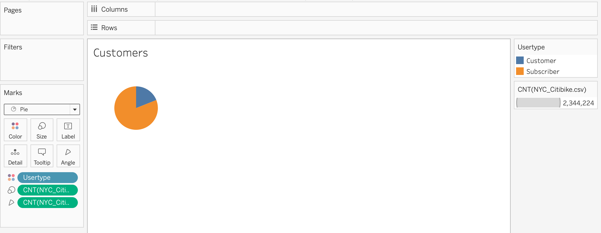

# bikesharing
# Overview/purpose of the analysis:
The goal of this project is to see whether it would make sense to create a bike-sharing program in the city of Des Moines. The purpose is to create a bike trip benchmark analysis based on a similar business model operated out of New York City. Using data retrieved online, I created a database using Python's Pandas library, and exported into a csv file, which I then uploaded to Tableau Public, where I created a set of visualizations, aggregated as a story, that summarize different aspects of this business.

# Data location :
Due to data size limits on GitHub (no more than 100 MB), raw .csv data has been uploaded to Google Drive and can be found in the following link:
https://drive.google.com/drive/folders/1e0X8LM6z_UETeBfeCLL-CNjtcUHuuxuF?usp=sharing

# Results:
## Checkout Times for Users:
Most trips last less than 20 mins (5 mins on average).

## Trips by Weekday per Hour:
Peak bike utilization occurs on Thursdays at 8 AM, 5PM to 6PM, Mon-Wed, 5-6PM.

## Trips by Gender (by Weekday per Hour):
Peak utilization times are practically the same accross all genders. 

_F.png)

_M.png)

_U.png)

## Customers:
Bike sharing services are used more often by subscribers than customers.

## Checkout Times by Gender:
Men are the largest users of bike sharing services.

## Gender Breakdown:
65% of bike sharing users are men.

## User Trips by Gender by Weekday:
Men utilize the bike sharing service mostly on Thursdays and Fridays.

# Summary and other possible visualizations:

## Summary:
To summarize, men are the largest users of bike-sharing services- representing 65% of all customers. They should be the target customer group. Peak utilization occurs mostly Mon through Thursday from 5PM to 6PM and on Thursdays at 8 AM for all genders. Subscribers tend to use the service more often, as opposed to non-subscriber groups. Findings/Tableau Public Story can be found in the following link: 
https://public.tableau.com/app/profile/fatima.zahra.el.mansouri/viz/NYC_Citi_Bike_Analysis_16701887188120/NYCCitiBikeAnalysis?publish=yes

## Other possible visualizations:
Additional visualizations include :
* User type by gender-i.e how many men subscribe vs how many women? 
* Starting locations by gender : are there specific areas in which men tend to rent bikes more than women or vice versa?
* Starting locations by gender by age: where are young people renting their bikes from? 
* Other charts that might require additional data: user type by income level, nearby competing businesses and where there starting points are, growth rate of the bike-sharing model over the last few years, etc.